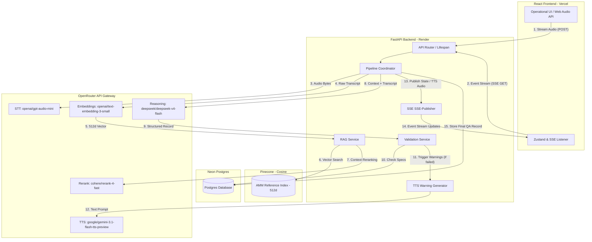

# System Architecture — mro-tts

This document outlines the end-to-end architecture, data flows, communication interfaces, and performance standards of the **mro-tts** (Maintenance, Repair, and Overhaul - Text to Speech/System) application.

---

## 1. System Overview

`mro-tts` is a realtime operational utility used by aviation mechanics to record, validate, and persist maintenance actions hands-free. Below is the system topology mapping the interactions between the React frontend, the FastAPI backend, active external AI models (via OpenRouter), databases, and storage.



---

## 2. Core Operational Lifecycle & Data Flow

The processing flow is initiated when a maintenance technician speaks into the application:

1.  **Recording Initiation**: The user holds the central record button. The Web Audio API captures audio input (16kHz, mono, PCM wav or webm format) and streams or batches the payload to the backend.
2.  **SSE Subscription**: The client establishes an EventSource connection at `/api/v1/records/stream?connection_id=xyz`. The server maps this connection ID to push events.
3.  **Audio Transmission**: The client uploads the recorded audio file to `/api/v1/records/process` referencing the `connection_id`.
4.  **Speech-to-Text (STT)**: The backend sends the audio payload to `openai/gpt-audio-mini` via the OpenRouter gateway. It returns the raw text transcript.
5.  **RAG Context Retrieval**:
    *   The transcript text is converted into a **512-dimension** vector using `openai/text-embedding-3-small`.
    *   A vector similarity query is run against Pinecone to pull relevant Aircraft Maintenance Manual (AMM) chunks.
    *   Cohere Rerank (`cohere/rerank-4-fast`) scores the chunks to isolate the top-K reference pages containing critical torque or safety wire requirements.
6.  **Deep Reasoning & Extraction**: The transcript text and the retrieved AMM contexts are sent to `deepseek/deepseek-v4-flash`. The model extracts a structured JSON object representing the work done (e.g., part name, torque setting, safety wire application state).
7.  **Maintenance Validation**: The backend checks the extracted specs (e.g., actual torque of 45 ft-lbs) against the AMM specifications retrieved (e.g., required torque: 40-50 ft-lbs). It computes a `PASS` or `FAIL` validation status.
8.  **Warning Audio Generation**: If validation fails (e.g., torque too low or missing safety wire), the backend sends the text of a safety warning to `google/gemini-3.1-flash-tts-preview` to generate warning audio bytes.
9.  **Persistence**: The final structured QA record (including transcript, validation details, matching AMM page references, and verification status) is written asynchronously to Neon PostgreSQL.
10. **Stream Finalization**: The connection is closed after emitting the final execution report.

---

## 3. RAG Pipeline Architecture

To guarantee exact validation matches (such as verifying torque parameters for hydraulic actuators), the RAG pipeline is designed to be highly deterministic:

### Knowledge Ingestion (Offline Pipeline)
*   **Source Data**: PDF/Text versions of AMM documentation.
*   **Chunking Strategy**: 400 to 700 tokens per chunk to maintain sufficient context around maintenance tables and diagrams, with a sliding window overlap of **80 tokens** to prevent losing edge definitions.
*   **Embeddings**: Generated via `openai/text-embedding-3-small` with `dimensions=512`.
*   **Storage**: Stored in a Pinecone index using **Cosine Similarity** metric.

### Query Pipeline (Realtime)
1.  **Semantic Search**: Query vectors are generated using the same model and dimension.
2.  **Top-K Retrieval**: Pinecone returns the top 15 most similar chunks.
3.  **Rerank Step**: The 15 chunks are passed to `cohere/rerank-4-fast` along with the technician's transcript. Chunks are reordered, and the top 3 chunks with high relevance scores (above a configurable threshold, e.g., `0.65`) are selected.
4.  **Prompt Assembly**: The top 3 chunks are formatted into a markdown schema block and passed directly to the reasoning model.

---

## 4. SSE Streaming Specification

Because the pipeline relies on multiple asynchronous external API calls (STT -> RAG -> Reason -> TTS), the UI must stream live progress so the technician is never left waiting in silence.

```
Client (Vite)                       Server (FastAPI)
      |                                    |
      |------ GET /stream?conn_id=123 ---->|  (Establish Event Stream)
      |<----- SSE: connection_established -|
      |                                    |
      |------ POST /process (Audio) ------>|  (Upload audio payload with conn_id)
      |<----- 202 Accepted ----------------|
      |                                    |
      |<----- SSE: transcribing -----------|  (STT call launched)
      |<----- SSE: transcript -------------|  (Raw transcript string returned)
      |<----- SSE: retrieving -------------|  (Pinecone semantic query initiated)
      |<----- SSE: references -------------|  (List of AMM document paths & IDs)
      |<----- SSE: extracting -------------|  (Pydantic extraction launched)
      |<----- SSE: extracted_record -------|  (Structured JSON properties)
      |<----- SSE: validating -------------|  (Compliance check against AMM specs)
      |<----- SSE: validation_result ------|  (PASS/FAIL state emitted)
      |<----- SSE: warning_alert ----------|  (Optional: Base64 audio string if FAIL)
      |<----- SSE: complete --------------|  (DB Transaction saved. Stream closed)
```

### Stream Event Recovery
- **Reconnections**: The SSE server uses unique connection IDs. If a connection drops, the client reconnects passing `Last-Event-ID` or `conn_id` to re-fetch the stream buffer state.
- **Buffer Timeout**: The FastAPI memory cache holds active stream buffers for up to 60 seconds to allow clients to recover dropped connections.

---

## 5. Architectural Boundaries & Division of Responsibility

### Frontend (React / TypeScript / Zustand)
- **Role**: Pure UI, hardware audio capture, and stream visualization.
- **Boundaries**:
  - Captures raw audio via Web Audio API using a dedicated worker thread (avoiding main-thread stuttering).
  - Listens to the `/api/v1/records/stream` EventSource. Reconciles incoming stream events to update the global Zustand state store.
  - Controls animations (e.g., pulsating recording state, color-coded validation screens, audio visualizer) with Framer Motion.
  - Playback warnings: Decodes and plays raw base64 PCM/MP3 warning streams emitted by the server.

### Backend (FastAPI / services / pipelines)
- **Role**: Pipeline coordination, AI model interfacing, business logic validation, and database operations.
- **Boundaries**:
  - Exposes SSE GET endpoint and POST process endpoint.
  - Manages third-party SDK connections (OpenRouter client pool, Pinecone client instance).
  - Handles RAG document matching, Cohere formatting, and token counting.
  - Emulates a transaction supervisor: updates database entries only upon successful validation check or handles clean rollbacks.

### Databases (Pinecone / Neon Postgres)
- **Role**: High-availability persistence.
- **Boundaries**:
  - Pinecone contains static AMM manual embeddings. Read-only in production operational flows.
  - Neon Postgres contains operational QA logs, compliance statuses, and reference mapping tables. Read-write asynchronously.

---

## 6. Scaling Assumptions & SLA Constraints

- **Audio File Size**: Maximum 30 seconds of recording (~1.5 MB PCM).
- **Latency SLAs**:
  - End-to-end execution: `< 4.5 seconds` under ideal conditions.
  - STT response: `< 1.2 seconds`.
  - Retrieval & Rerank: `< 800ms`.
  - Reasoning & Extraction: `< 1.5 seconds`.
  - TTS warning generation: `< 1.0 seconds`.
- **Concurrent streams**: Target system design supports 100 concurrent recording streams per standard application instance.
- **Database Connection Pooling**: SQLAlchemy configured with `pool_size=20`, `max_overflow=10` per FastAPI container to manage bursts in maintenance records submissions.
